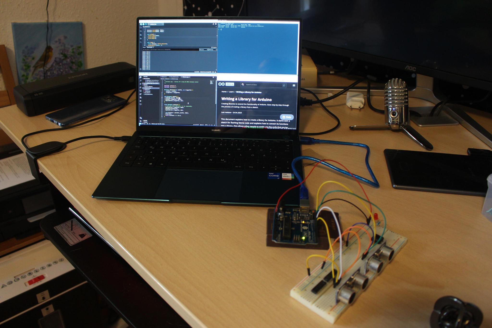

# Distance libary



Simple libarry to ask for distances from an
HC-SR04.

## Wiring

Four cables, looking at the back from left to right:
Gnd: Ground
Echo: Digital pin on arduino, used for reading
Trig: Digital pin on arduino, used for writing
Vcc: 5V connector

## Example implementation
This implementation can be seen on the photo. It uses two separate distance sensors.

```C
#include <Distance.h>

#define TRIG1 12
#define ECHO1 13

#define TRIG2 7
#define ECHO2 8

Distance dist1(ECHO1, TRIG1);
Distance dist2(ECHO2, TRIG2);

void setup() {
  Serial.begin(9600);
  dist1.setup();
  dist2.setup();
}

void loop() {
  float distance = dist1.measure();
  Serial.print("Dist1: ");
  Serial.print(distance);
  Serial.println(" cm");

  distance = dist2.measure();
  Serial.print("Dist2: ");
  Serial.print(distance);
  Serial.println(" cm");
  delay(5);
}
```
